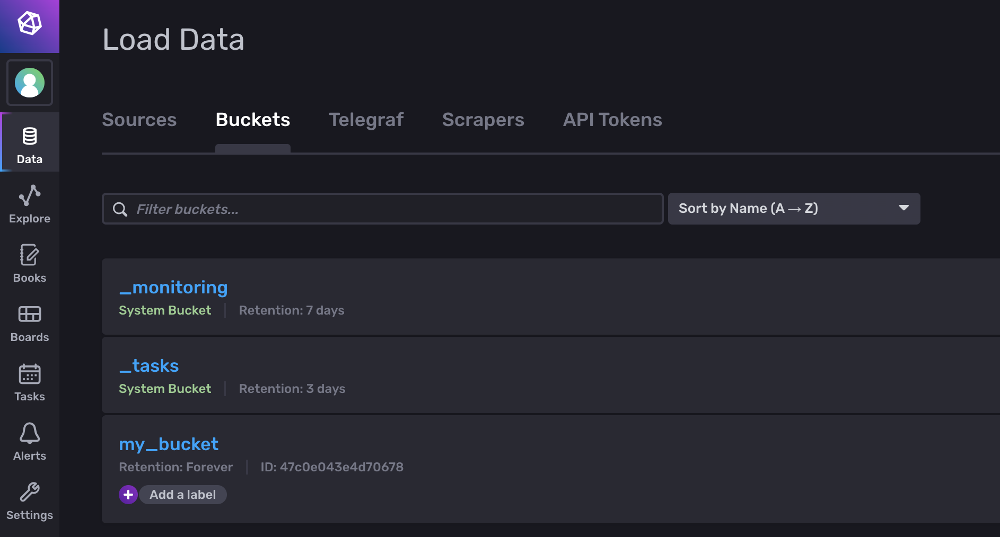
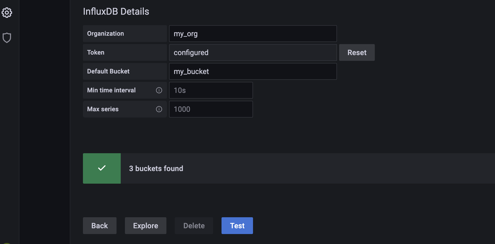

# docker-compose-influxdb-v2-grafana [](https://github.com/ansjin/docker-compose-influxdb-v2-grafana/blob/main/LICENSE)

This repository is for building multi-container application with : 
1. [InfluxDB_v2](https://www.influxdata.com/blog/influxdb-2-0-open-source-is-generally-available/) - a time series database
2. [Grafana](https://grafana.com/grafana/) - for visualization of data stored in InfluxDB


**This repository specifically support InfluxDB 2.x**

## Installation and requirements
1. [docker-compose](https://docs.docker.com/compose/install/) on the docker host.

## Running and stopping

### Running
1. Clone the repository
```bash
git clone https://github.com/ansjin/docker-compose-influxdb-v2-grafana.git
```
2. Change default credentials stored in `.env` file: 
```bash
INFLUXDB_USERNAME=admin
INFLUXDB_PASSWORD=secure_influx_admin_password
INFLUXDB_ORG=my_org
INFLUXDB_BUCKET=my_bucket
INFLUXDB_ADMIN_TOKEN=a_secure_admin_token

GRAFANA_USERNAME=admin
GRAFANA_PASSWORD=secure_influx_admin_password
```

3. Optionally add dashboards in `./grafana-provisioning/dashboards/`.
4. Run the following command as root
```sudo docker-compose up -d --build```

### Stopping 
Run the following command as root
```sudo docker-compose down```

### Quick provisioning (optional)
Run the following command as root
```./run.sh```

## Ports Configuration

The Grafana and InfluxDB in the app are exposed on the following host ports:

| Port | Service |
| - | - |
| 3000 | Grafana |
| 8086 | InfluxDB |

## Working Screenshots
### InfluxDB
<p align="center">
</img>
</p>

### Grafana
<p align="center">
</img>
</p>

## Help and Contribution

Please add issues if you have a question or found a problem. 

Pull requests are welcome too!

Contributions are most welcome. Please message me if you like the idea and want to contribute. 
